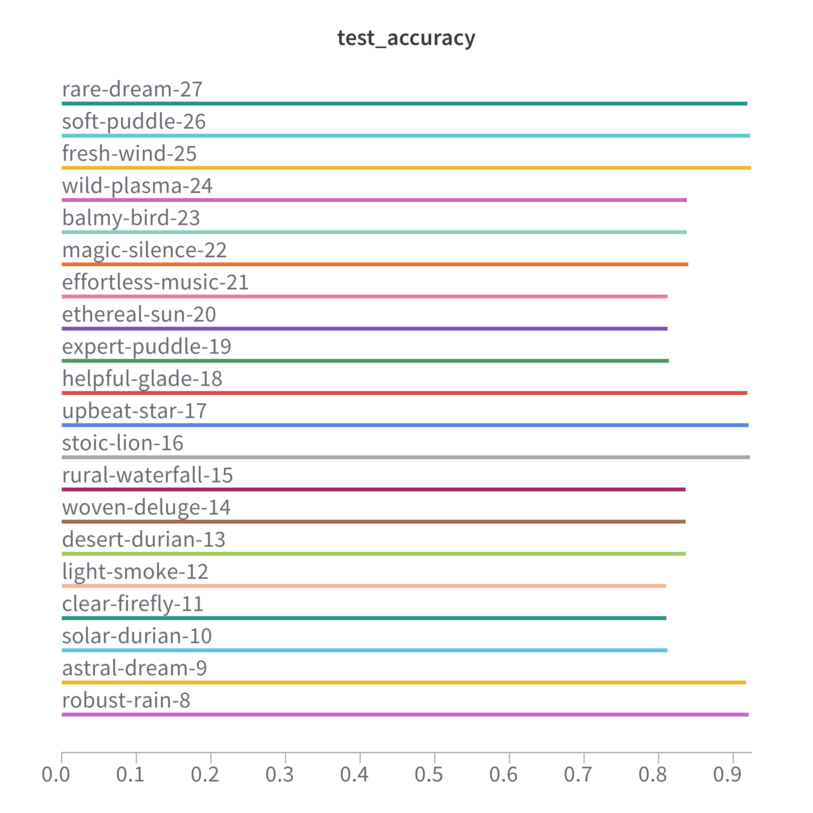
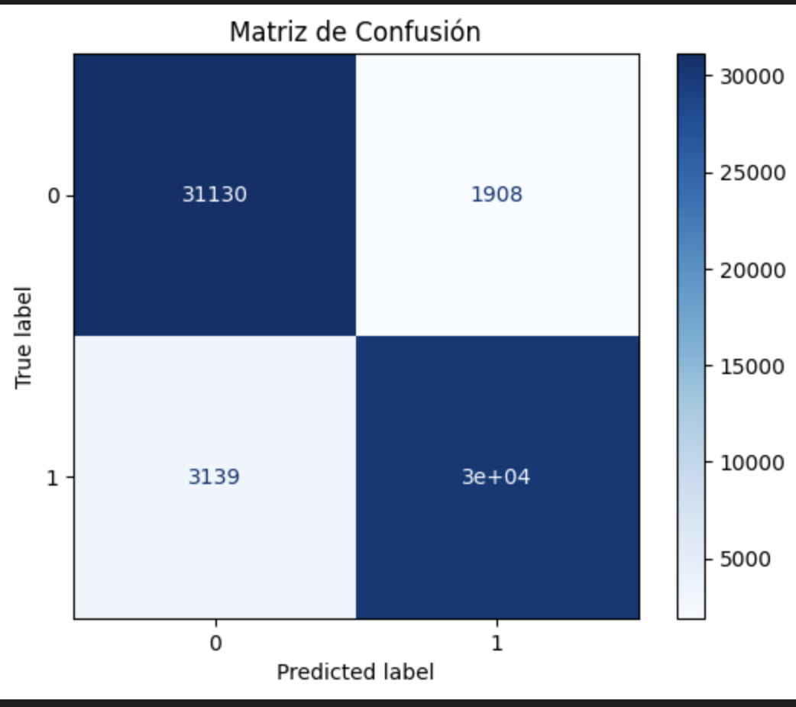
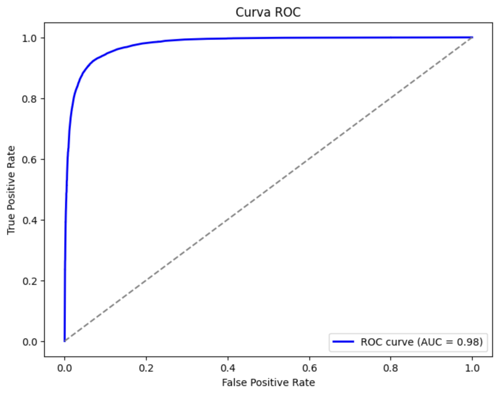

# Amazon Recommender System Project

## **Introducción**

### **Caso de estudio**
El análisis de reviews de usuarios en plataformas e-commerce, como Amazon, permite a las empresas comprender mejor la percepción de sus productos y servicios. Por lo que, este estudio se centra en clasificar las reviews de Gift Cards de Amazon del año 2023 como positivas o negativas, utilizando técnicas NLP y machine learning. Asimismo, el objetivo es implementar un modelo que ayude a identificar patrones y tendencias en los comentarios de los usuarios, facilitando la toma de decisiones estratégicas para los vendedores.

### **Justificación**
La clasificación automática de reviews de Gift Cards de Amazon es vital, ya que las opiniones de los usuarios son determinantes para la percepción de los productos y servicios. Ante esto, el presente trabajo permite a las empresas identificar patrones y tendencias, de tal manera que puedan tomar las mejores decisiones empresariales para sus productos. Además, proporciona a los consumidores una forma estructurada y accesible de evaluar la calidad de los productos. Finalmente, el uso de tecnicas de NLP y Machine Learning, garantizan un alto grado de aprovechamiento de un dataset actualizado, de esta forma se podra ofrecer una solución escalable y automatizada.

## **Dataset**
### Amazon Reviews'23

### **Descripción**

El dataset Amazon Reviews 2023 es un recurso de gran escala que contiene reseñas de productos de Amazon junto con información extensa en metadatos y enlaces entre usuarios y productos. Este fue diseñado para la investigación en sistemas de recomendación e interpretación del lenguaje natural.

### **Origen**

Este dataset fue recopilado por McAuley Lab y cubre interacciones desde mayo de 1996 hasta septiembre de 2023, siendo una versión ampliada y mejorada de ediciones anteriores.

**Versiones anteriores**

|Año|#Review|#User|#Item|#R_Token|#M_Token|#Domain|Timespan|
|:-:|:-:|:-:|:-:|:-:|:-:|:-:|:-:|
2013|34.69M|6.64M|2.44M|5.91B|–|28|Jun’96 - Mar’13
2014|82.83M|21.13M|9.86M|9.16B|4.14B|24|May’96 - Jul’14
2018|233.10M|43.53M|15.17M|15.73B|7.99B|29|May’96 - Oct’18
2023|571.54M|54.51M|48.19M|30.14B|30.78B|33|May’96 - Sep’23

Tablero extraído de Amazon Reviews'23

### **Tamaño**

**Para el dataset de Gift_Cards**

**Reviews**

- Tamaño aproximado por línea: 233 B.
- Cantidad de líneas: 152,410.
- Peso total estimado: ~35.5 MB.

**Metadata**
- Tamaño aproximado por línea: 2.33 KB.
- Cantidad de líneas: 1137.
- Peso total estimado: ~2.65 MB.

## **Dificultades técnicas**
Dificultades técnicas que tuvimos fue:
* La limpieza de los datos del campo "text". Estos tenian mucho ruido, como los espacios, emojis, negritas, etiquetas HTML, etc.
* Desbalanceo del dataset, estos tienen mas reviews positivas que negativas, lo cual puede afectar en la etapa de entrenamiento del modelo, por lo que es vital filtrarlo de manera adecuada y equitativa
* Manejo de lenguaje, ya que el dataset contiene variados textos en diferentes idiomas, lo cual podria afectar el etiquetado de nuestro modelo a traves de la LLM.
* Implementacion del modelo LLM para el etiquetado de nuestro dataset, tanto en Pandas como Dask.
* El modelo LLM solo permite 512 tokens de texto, ante esto, se tuvo que filtrar aquella data que no exceda esta cantidad.

## **Herramientas empleadas**
- MongoDB
- Datalake
- Dask y Pandas
- LLM y Random Forest
- Seguimiento de experimentos (W&B)
- Spark

## **Cómo ejecutar el proyecto**
1. Tener instalado Python 3.12 
2. Instalar las dependencias a traves del requirements.txt (revisar archivo ''notebook.ipynb'')
3. Crear una base de datos local en MongoDB Compass
4. Crear el diccionario ''gift-cards''
5. Crear el diccionario ''meta-gift-cards''
6. Correr todo el archivo ''notebook.ipynb''

## **Arquitectura del proyecto**

### **Diagrama**

### **Descripción**

## **Proceso ETL**

### **Extracción**
La extraccion de los datos se llevo a cabo de manera automatizada a traves de un link de descarga en la que se obtiene un archivo ''gz'', posteriormente lo descomprimimos y guardamos en la carpeta ''data''. Asimismo, para la eleccion de un correcto grupo de datos del dataset, se realizo un filtrado a traves de una consulta en MongoDB en la cual garantizamos que las reviews no contengan anomalias o data atipica.

### **Transformación**
La transformacion de los datos se lleva a cabo en la limpieza de estos para su posterior carga, en este apartado nos encargamos de eliminar el ruido en el atributo "text", estos contenian etiquetas HTML, emojis, negritas, espacios, exceso de caracteres especiales.

### **Cargado**
El cargado de nuestro dataset se lleva a cabo utilizando MongoDB, herramienta que nos facilito el filtrado para escoger el grupo de datos que llevaremos a cabo durante todo el estudio y posterior entrenamiento de nuestro modelo.

## **Resultados obtenidos**

### **Análisis**

#### **Test accuracy**

El uso de WandB facilitó la comparación entre varias configuraciones de hiperparámetros, permitiendo seleccionar los hiperparametros que maximizaron el desempeño en términos de precisión. De todos los experimentos, el fresh-wind-25 tuvo el de mejor desempeño con un accuracy de 92.38%, y usando como base los siguientes hiperparámetros, n_estimators: 200, max_depth: null, min_samples_split: 2 

  

#### **Reporte de Clasificación**

El siguiente reporte muestra las métricas de clasificación obtenidas con los datos de prueba usando el mejor modelo:

| Clase         | Precisión | Recall | F1-Score | Soporte |
|---------------|-----------|--------|----------|---------|
| **Clase 0**   | 0.91      | 0.94   | 0.93     | 33038   |
| **Clase 1**   | 0.94      | 0.91   | 0.92     | 33205   |
| **Exactitud** |           |        | 0.92     | 66243   |
| **Macro Avg** | 0.92      | 0.92   | 0.92     | 66243   |
| **Weighted Avg** | 0.92  | 0.92   | 0.92     | 66243   |

El modelo seleccionado alcanzó un accuracy de 92.38% en los datos de prueba. La clase 0 (reviews negativas) obtuvo una precisión del 91% y un recall del 94%, mientras que la clase 1 (reviews positivas) alcanzó una precisión del 94% y un recall del 91%. Indicando un buen desempeño de predicción para ambas clases.

#### **Matriz de confusion**

La matriz de confusión muestra el desempeño del modelo clasificando 31,130 reseñas negativas y 30,066 reseñas positivas, mostrandando una buena prediccion para ambas clases. Sin embargo, se observan 1,908 falsos positivos  y 3,139 falsos negativos. Esto indica que el modelo podria clasificar incorrectamente las clases, por lo que se necesita ajustar los hiperparámetros, balancear aún más los datos o considerar otras características.

  

#### **Curva ROC**

La curva ROC muestra qué tan bien el modelo distingue entre reseñas positivas y negativas. En nuestro caso, el área bajo la curva es 0.98, lo cual indica que el modelo es bueno para identificar las reseñas, tanto positivas como negativas.

  

## **Dificultades**

- ⁠Elegir el algoritmo ideal para el aprendizaje de nuestro modelo
- ⁠Elevado costo computacional al momento del etiquetado y entrenamiento del modelo, debido a la falta de GPU
- ⁠La implementacion del modelo nos obligaba a escoger los hiperparametros adecuados para garantizar un mejor accuracy
  
## **Conclusiones**

### **Posibles mejoras**

- Ajustar los hiperparámetros con validación cruzada para evitar sobreajuste y mejorar la generalización del modelo.
- Mejorar el balanceo de clases, aplicando smote solo a características numericas y para la parte de texto usar técnicas como resampling basado en tokens (Word2Vec, GPT).
- Implementar un pipeline para limpieza de texto que incluya detección de idiomas, para mejorar el manejo de textos en varios idiomas.

